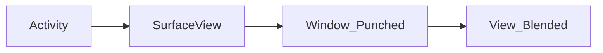
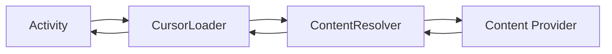

# Android

**Context** Application 환경에 대한 글로벌 정보에 접근하기 위한 인터페이스

### 구성요소

#### 1. Activity
사용자와 상호작용하는 화면 단위, 뷰 또는 뷰그룹


* **SurfaceView** : Grid System X, 원하는시점에 바로 화면에 그려야하는 게임, 영상 개발에 쓰임
* **Window** : Top-level의 외관과 동작 정책의 추상 Class, 기본 배경 & 타이틀 영역 & 기본 처리들의 표준 UI 정책 제공

* **Lifecycle**


* **View 그리는 순서**
- OnAttachedToWindow
- measure
- OnMeasure : 뷰의 크기를 결정
- layout : 뷰의 위치를 결정
- OnLayout
- dispatchDraw
- draw
- OnDraw : 화면을 그린다

* **Task**
Application에서 실행되는 Activity를 Stack 형태로 관리.
그 단위를 Task라고 함. (== Activity 작업의 묶음)
Flag를 통해 Activity의 흐름을 제어한다.

* **Affinity**
친화력, Flag ACTIVITY_NEW_TASK로 호출 시 Affinity가 지정되어 있으면 같은 Affinity Task에서 실행

* **Flag (Launch mode)**
  - Standard : [Default] 여러개의 인스턴스 생성. 어느곳이든 위치가능
  - SingleTop : Standard와 유사, TopActivity가 동일할 경우 onNewIntent를 호출하여 재사용.
  - SingleTask : 새 작업의 RootActivity로 생성. 하나의 인스턴스만 생성 가능 (이미 같은 환경은 onNewIntent 호출)
  - SingleInstance : Task 내 해당 Activity 한개만 실행 가능. 다른 Activity는 다른 Task로 실행.

#### 2. Service
Background에서 실행되는 요소.
오랫동안 실행이 필요하거나 원격 프로세스를 위한 작업을 수행할 때 사용.
Process Options 설정 시 Process 분리 가능.

* Start Service
  Background에서 무기한 실행, 작업 완료 후 중단 요청 필요
* Bound Service
  서비스 상오작용 가능, 바인딩 해제 필요 (ex_음악 플레이어)
* Intent Service
  Service의 SubClass, Background Thread 사용.
  모든 시작요청을 처리하지만 하나씩 순차로 처리.
  종료 할 필요 없음.

#### 3. Broadcast Receiver
앱이 실행중이지 않아도 시스템으로 부터 등록한 Intent(알림)을 전달 받는다.
Application간에 데이터를 공유하는 가장 간단한 방법 (1:N)
동작을 위해서는 Activity가 최소 1회 활성화 되어야한다.

#### 4. Provider
Content provider는 외부 Application의 data를 표기하며, data는 관계형 Database 형태로 제공된다.

* **관계형 데이터 베이스**
키와 값의 관계를 나타내는 테이블로 구성. 이는 데이터의 종속성 (Relationships)을 표현. 정렬|탐색 속도 좋음. 스키마 수정이 어렵고 부하 분석이 어려움.


**ContentResolver** 제공자 객체와 통신, CRUD


### Components


#### ListView, RecyclerView, ViewHolder

**ListView**
View를 재상용할 수는 있지만 빈번한 findViewByIds를 사용하여 성능이 저하됨.
```Java
View getView(...) {
  if (content == null) {
    content = context.inflater(R.layout.view, parent, false);
  }
  textview = content.findViewByIds(R.id.textview);

  return content;
}
```
**ViewHolder Pattern**
ViewHolder Pattern을 사용하여 문제 개선.
View를 객체화 시켜서 단점을 보완함.
Tag를 사용하여 ViewType도 구분가능.
> Static Class (정적 내부 클래스)로 선언. Outer class 멤버에 접근을 제한하여 메모리 누수에 방어함.

**RecyclerView**
ViewHolder Pattern을 강제화하고, View Type을 int 형으로 관리 할 수 있음. LayoutManager를 통해 다양한 뷰 모양 연출 가능.


#### Actionbar & Toolbar
Actionbar는 Activity에 고정으로 지원
Toolbar는 layout xml에 직접 정의

### ART. Android Runtime
* __Origin__
JIT.Just in time 컴파일 방법을 사용
Dalvik VM에 바이트 코드를 하나씩 기계어로 변환하면서 실행
* __5.0 21 LOLLIPOP__
ART VM이 AOT(Ahead of time) 컴파일 수행
바이트코드를 CPU가 필요로 하는 명령어로 미리 변경 (ELF, Executable and linkable format)
* __7.0 24 NOUGAT__
ART VM, JIT + AOT  


### ANR. Application Not Response
Application이 5초 이상 사용자 입력에 반응이 없을 때.
Broadcast Receiver가 10초 이내에 리턴하지 않을 때.


### Memory

#### Memory Model
> Ref
> [Android 앱 메모리 최적화](https://d2.naver.com/helloworld/539525)


#### Memory leak
  - 방지 방안
    - 정적 내부 클래스 사용
      전역 클래스 객체에만 접근 가능하여 외부 인스턴스 필드에 접근 불가
    - 약한 참조 사용
      가비지 컬렉션 가능
    - 쓰레드 실행 중지 및 메세지 큐 정리
    - 쓰레드 유지
      쓰레드와 안드로이드 생명주기 불일치

  - 예제
    - Static Activity, View
    - 내부 클래스 : 외부 클래스 변수에 접근 가능 하기 때문
    - 익명 클래스. Anonymous Class : Activity 종료 후에도 유지 될 수 있음.
    - Thread, Handler, Timer : 익명으로 선언된 Runnable 객체로 처리 불가시 누수 발생 가능
    - 센서 관리자 : 등록해제 안하면 누수 발생 가능

#### Image Cache
  - 이미지 해상도를 미리 알아내서 필요한 사이즈 비율로 로딩한다.
  - 이미지 캐싱. 메모리 캐싱(LruCache) + 디스크 캐싱(LruDiskCache)


#### Doze Mode
Marshmallow 6.0 - 충전, 움직임 모두 아닌 상황
Nougat 7.0 - 2단계, 충전만 아니여도 실행

[Doze1]
네트워크 엑세스 정지, SyncAdapter 정지, Jobscheduler 사용 불가
[Doze2]
Wakelocks 무시, AlarmManager 연기, Wi-fi 스캔 사용 불가

* 대응 방안
  화이트 리스트 등록, 알람 매니저 사용, FCM 활용, Foreground Service 활용

#### AppStandby
앱을 유휴 상태로 지정
앱 명시적 실행, Foreground Service, 알림생성, 기기 관리앱 > 모두 아닌 경우 터치 안하는 상태에서 실행


### 프로세스 간 통신
IPC, AIDL. Android Interface Definition Language.
