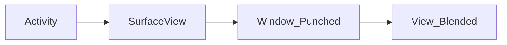

# Android

**Context** Application 환경에 대한 글로벌 정보에 접근하기 위한 인터페이스

### 구성요소

#### 1. Activity
사용자와 상호작용하는 화면 단위, 뷰 또는 뷰그룹

* **SurfaceView** : Grid System X, 원하는시점에 바로 화면에 그려야하는 게임, 영상 개발에 쓰임
* **Window** : Top-level의 외관과 동작 정책의 추상 Class, 기본 배경 & 타이틀 영역 & 기본 처리들의 표준 UI 정책 제공

* **Lifecycle**

#### 2. Service
Background에서 실행되는 요소.
오랫동안 실행이 필요하거나 원격 프로세스를 위한 작업을 수행할 때 사용.
Process Options 설정 시 Process 분리 가능.

* Start Service
* Bound Service
* Intent Service

#### 3. Broadcast Receiver

#### 4. Provider

#### Draw View
