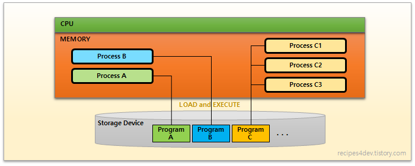
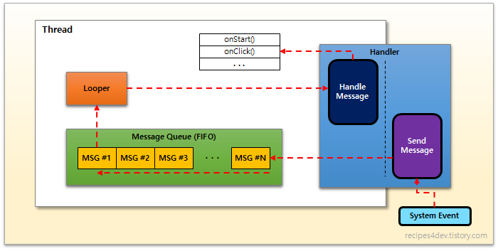
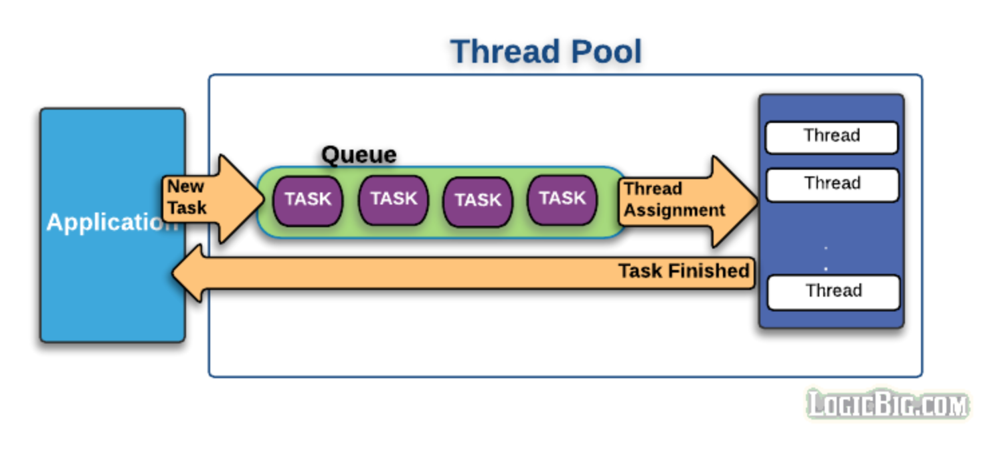

# Thread
> Process 내에 _순차적으로 실행되는 실행 흐름_ 의 최소 단위
> ##### Refs
> * [안드로이드 스레드(Android Thread)](https://recipes4dev.tistory.com/143)
> * [안드로이드 백그라운드 잘 다루기 Thread, Looper, Handler](https://academy.realm.io/kr/posts/android-thread-looper-handler/)
> * [Thread 와 Android Main Thread](http://cafe.daum.net/_c21_/bbs_search_read?grpid=1MWA2&fldid=aAfL&datanum=98&docid=1MWA2%7CaAfL%7C98%7C20110704111711)
> * [안드로이드 앱 프로세스 분리하기](https://brunch.co.kr/@huewu/4)

#### Program
명령과 데이터로 구성되어 저장 장치(Storage Device)에 저장된 형태의 실행코드

#### Process
현재 메모리에 로딩되고 실행 중인 프로그램, 운영체제에 의해 메모리에 적재되어 실행 중인 프로그램

안드로이드의 애플리케이션을 실행하면 시스템은 메인 액티비티를 메모리로 올려 프로세스로 만들며, 이 때 메인 스레드(==UI Thread)가 자동으로 생성됩니다.

#### Thread Create
  1. **extends Thread**
    * Thread Class 확장
    * Task 세부 기능 수정 가능
    * 오버 헤드 발생 가능
  2. **implements Runnable**
    * runnable 인터페이스만 구현할 경우 간결하게 구현 가능
    * 논리적으로 분리된 Task 설계 가능

#### ActivityThread (MainThread, HandlerThread)
사용자가 입력할 이벤트 처리, 화면 GUI 그리기 /
_순차처리가 중요하므로 꼭 동일한 쓰레드에서 처리_

  

  **처리 순서**
  * System Event Message 전달
  * Handler가 MessageQueue에 전달
  * Looper가 MessageQueue에 Message가 있는지 확인
  * 순차적으로 (FIFO) 처리한 Message를 Handler에 전달
  * Handler가 Message 처리

#### AsyncTask
HandlerThread를 별도로 개발하지 않고도 사용 가능. 제네릭스(Generics)로 내부 타입 설정도 가능하고, onPreExcute(), onPostExcute(), onProgressUpdate()에서 UI변경 작업을 할 수 있다.

# MultiThread
> Main(UI) Thread에서 시간이 걸리는 작업을 실행한다면, Application의 반응성은 낮아지고,(자원효율성 저하) ANR(Android Not Responding) 상태로 전환 될 수도 있다. 따라서 작업을 여러 Thread로 분리하고 Thread간에 통신 하는 방법이 필요하게 되었다.

> ##### Refs
> * [Executor Framework에대한 고찰 - 1](https://www.childc.co.kr/629)
> * [Executor Framework에대한 고찰 - 2](https://www.childc.co.kr/631)
> * [Executor Framework에대한 고찰 - 3](https://www.childc.co.kr/633)
> * [Volatile](https://www.childc.co.kr/632)
> * [쓰레드풀 과 ForkJoinPool](https://hamait.tistory.com/612)

#### 병렬프로그래밍
여러개의 프로세서를 효율적으로 사용가능하며, 전반적인 속도를 향상시킬 수 있다.

**Thread를 과도하게 생성하게 되면?**
  1. _Overhead_ (Thread 생성/취소/종료 후 자원을 반환하는데 비용이 많이 소모된다. Thread가 많이 생성될 경우 OOM이 발생할 수 있다.)
  2. _자원관리_ (하드웨어의 프로세서보다 더 많은 Thread 생성 시 대기상태의 Thread가 많아지고, 메모리를 많이 차지한다.)

#### Thread Pool
  

**Thread의 재사용**
Get Task (Worker Queue) -> Task Run -> Repeat or Wait

#### Executor Framework (작업 스케쥴링)
Executor는 작업의 등록과 실행을 분리하는 표준적인 방법 (Producer-Consumer Pattern) 
작업을 정의하는 영역, 실행하는 영역 분리 - 실행 정책(Execute Policy)을 자유롭게 변경 가능
* 작업할 큐의 크기 지정
* 작업 우선 순위 지정
* 작업을 실행할 쓰레드 지정
* 병렬로 작업할 쓰레드 크기 지정
* 자원 부족시 희생할 쓰레드 지정
* Pre/Post-Execution (작업 전후) 지정

**Executor Service**
* Executor의 생명주기관련 인터페이스
* Status
  1. Running
  2. Shutting Down
  3. Terminated

* 멀티
* 통신
* 스케쥴링
* 동기화
* 성능 튜닝
* 메모리 관리
