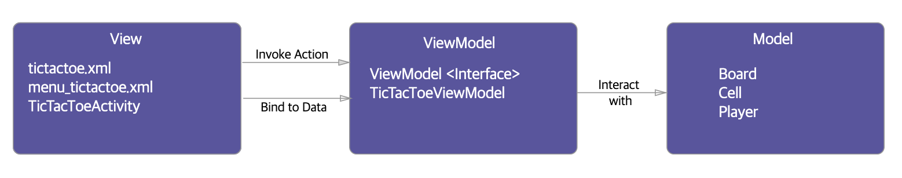

# Architecture

> **Ref**
> [안드로이드의 MVC, MVP, MVVM 종합 안내서](https://academy.realm.io/kr/posts/eric-maxwell-mvc-mvp-and-mvvm-on-android/)
> [클린 아키텍처를 안드로이드에 도입하는 방법](https://academy.realm.io/kr/posts/converting-an-app-to-use-clean-architecture/)
> [Android Architecture Components 소개](https://medium.com/@maryangmin/android-architecture-components-%EC%86%8C%EA%B0%9C-1-8e04491be1f6)

## MVC

모델 뷰가 확실하게 분리되어있지만, 컨트롤러에 문제가 있음.

**MODEL** 데이터 + 상태 + 비즈니스 로직, 재사용
**VIEW** 모델의 표현, UI & 사용자가 앱과 상호작용할 때 컨트롤러와 통신하는 책임
사용자의 행동에 따른 어떤 작업을 해야하는지 모름, 이유는 뷰가 모델에 종속되지 않음으로서 변화에 유연해지기 때문
**CONTROLLER** 뷰와 모델을 이어주는 역할. 뷰가 사용자 행동을 알려주면, 모델과 어떻게 상호작용할지 결정. (Activity, Fragment)

**Controller 문제**
- 테스트 용이성 : Controller(Activity)가 API에 깊게 종속되어 유닛테스트 어려움.
- 모듈화&유연성 : Controller와 View 결합도가 높음.
- 유지보수 : 기능이 많아지면 Controller 코드가 많아짐.

## MVP

컨트롤러에 모든 책임을 뭍지 않고 뷰와 액티비티가 자연스럽게 결합하도록 한다.

**MODEL** 동일
**VIEW** Activity, Fragment를 포함되어 이들이 서로에게 연관되는 자연스러운 현상을 극복할 필요가 없음. 간단한 유닛테스트 가능. 프레젠터와 연결할 인터페이스 정의 필요.
**PRESENTER** 컨트롤러 역할 이지만, 뷰와 인터페이스로 연결. 모듈 테스트 가능하며, 모듈화/유연성 문제도 해결 가능.

**Presenter 문제**  
- 유지보수 : 컨트롤러 처럼 기능이 많아지면 코드가 많아짐. 분리하기 어려움.

## MVVM

__데이터바인딩__ 을 사용함. 테스트와 모듈화가 쉽고 뷰와 모델을 연결하기 위해 사용하는 연결 코드를 줄일 수 있다.
테스트 할 때 MVP 처럼 가상뷰를 만들 필요 없이, 옵저버블 변수가 제대로 설정되었는지 확인하면 됨.

**MODEL** 동일
**VIEW** 뷰모델에 의해 보여지는 옵저버블 변수와 액션에 유연하게 바인딩됨.
**VIEWMODEL** 모델을 래핑하고, 필요한 옵저버블 데이터를 준비. 뷰가 모델에 이벤트를 전달할 수 있도록 훅(HOOK)을 준비함. 뷰모델이 뷰에 종속되지 않음.

**ViewModel 문제**  
- 유지보수 : 기능이 많아지면 프로젠테이션 로직이 늘어나 XML에 코드를 추가하게 될 수 있음.

# Clean Architecture

상위 레이어로만 종속성이 있음.
(ex_ 프리젠터는 데이터베이스를 모름. 엔티티는 유스케이스를 모름.)

- 도메인 로직 : 엔티티, 데이터, 모델
- 비즈니스 규칙 : 유스케이스
- 인터페이스 어댑터 : 프리젠터, 프리젠테이션 로직
- 프레임워크/드라이버 : UI, 네트워크, 데이터베이스

테스트 커버리지가 넓어짐.
각 기능이 독립적이게 되므로 테스트 클래스 작업에 용이 해짐.

## AAC (Android Architecture Components)

### 1.Lifecycles (Easy handling lifecycles)
### 2.LiveData (Lifecycle aware observable)
### 3.ViewModel (Managing data in a lifecycle)
### 4.Room (Object Mapping for SQLite)
### 5.Paging (Gradually loading information)

## TDD
