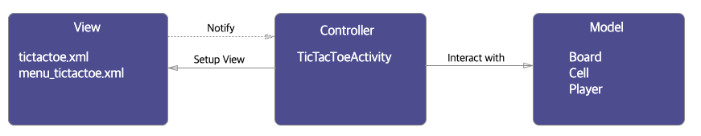
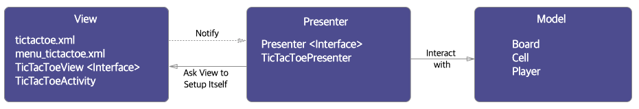

# Architecture

> **Ref**
> [안드로이드의 MVC, MVP, MVVM 종합 안내서](https://academy.realm.io/kr/posts/eric-maxwell-mvc-mvp-and-mvvm-on-android/)

## MVC

모델 뷰가 확실하게 분리되어있지만, 컨트롤러에 문제가 있음.

**Controller 문제**
- 테스트 용이성 : Controller(Activity)가 API에 깊게 종속되어 유닛테스트 어려움.
- 모듈화&유연성 : Controller와 View 결합도가 높음.
- 유지보수 : 기능이 많아지면 Controller 코드가 많아짐.

## MVP

컨트롤러에 모든 책임을 뭍지 않고 뷰와 액티비티가 자연스럽게 결합하도록 한다.
