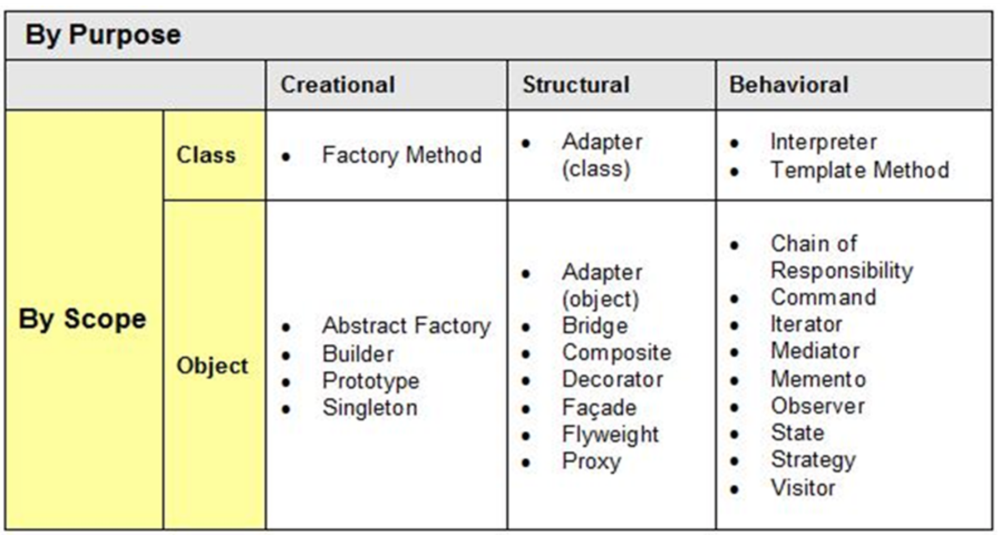

# Pattern

https://realzero0.github.io/study/2017/06/12/디자인-패턴-정리.html

#### Prototype
미리 만들어진 객체를 clone, clone을 정의.

#### Singleton
[Multi Thread 환경에서의 올바른 Singleton](https://medium.com/@joongwon/multi-thread-환경에서의-올바른-singleton-578d9511fd42)
활용 : 하나의 인스턴스만 존재해야할 경우
* thread-safe를 위해 synchronized 키워드 선언
역할에 비해 오버헤드 발생
  1. Double Checking (null check!)
  2. Enum
    인스턴스 한개 보장, 복잡한 직렬화, 리플렉션 상황도 자동 지원 | Context를 매번 넘겨야하는 불편한 상황을 도래할 수 있다.
  3. LazyHolder
    객체가 필요할 때 초기화를 미루는 방식 (정적내부 클래스)
    인스턴스 참조시 Class가 로딩되며 초기화 진행된다.

#### Builder
생성자 인자가 많을 때 고려 (유연)

#### Factory
객체 생성 위임, 결합도를 낮출 수 있음

#### Abstract Factory
서로 관련이 있는 객체들을 모아서 팩토리 클래스를 만들고 조건에 따라 다른 팩토리를 만들어 생성하는 패턴

#### Adapter
콘센트! (인터페이스 활용)
호환이 맞지 않은 인터페이스간을 연결 해줌

#### Bridge
구현부와 추상층을 분리하여 각자 확장하는 방식
동물 (호랑이, 새) - 잡는법 (물에서훅, 땅에서훅)

#### Composite
다양한 객체를 동일하게 취급하는 것이 목적 (같은 기능 인터페이스), Directory&File

#### Decorator
추가기능을 개별적인 클래스로 설계하고 기능 조합 (중복되는 기능 개발 최소화)

#### Proxy
직접 실행하지 않고, 우회 접근, 흐름만 제어할 뿐 결과값 조작하지 않음.

#### Chain of responsibility
역할 사슬 패턴 (onclick return)

#### Commend
실행될 기능을 캡슐화 시킴, 재사용성이 높음
호출자와 수신자의 의존성 낮춤

#### Iterator
구현과 분리해서 하나씩 셀 수 있다.

#### Strategy
전략을 쉽게 바꿀 수 있도록 함

#### State
상태에 따라 정의

#### Producer-Consumer
소비, 생성이 나눠져있는 패턴

#### Visitor
